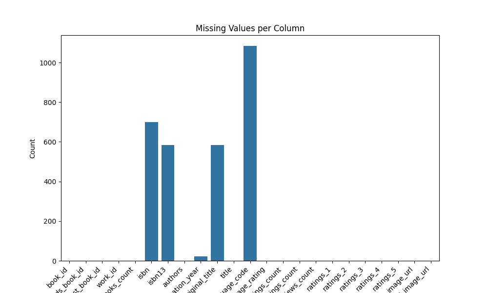

# **Goodreads Dataset Analysis: The Dark Knight's Perspective**

---

## **The Data Received: A Hidden World of Books**

Deep within the shadowy corridors of Goodreads, a vast dataset emerges, brimming with secrets. It whispers tales of books, their authors, their languages, their ratings, and the way readers connect with them. The data—structured yet fragmented—houses key elements like:

- **Unique Identifiers:** Book IDs, ISBNs, and Goodreads IDs, like fingerprints for each tome.  
- **Popularity Metrics:** Ratings, text reviews, and engagement scores that pulse like Gotham's heartbeat.  
- **Metadata:** Publication years, language codes, and the essence of the books themselves.  

But even the greatest data has flaws—missing values in **isbn**, **authors**, and **original_title** stand as riddles in the dark, waiting to be solved.

## **Summary Statistics: Numbers That Speak Truth**

Numbers are Gotham's silent guardians—they don’t lie. Here’s what they reveal:  

- The **average_rating** stands at **4.0**, a hopeful glimmer in the gloom.  
- Books stretch across time, from **-1750** to the modern day, reflecting the eternal nature of stories.  
- Reader engagement—**ratings_count** and **text_reviews_count**—forms the lifeblood of popularity.  
- Yet, the cracks show: **700 missing ISBNs**, **585 lost original titles**, and **1084 absent language codes**.  

The darkness is deep. But the data provides the tools to shine a light.

|                           |   count |   unique | top                                                                                      |   freq |            mean |              std |            min |             25% |              50% |             75% |              max |
|:--------------------------|--------:|---------:|:-----------------------------------------------------------------------------------------|-------:|----------------:|-----------------:|---------------:|----------------:|-----------------:|----------------:|-----------------:|
| book_id                   |   10000 |      nan | nan                                                                                      |    nan |  5000.5         |   2886.9         |     1          |  2500.75        |   5000.5         |  7500.25        |  10000           |
| goodreads_book_id         |   10000 |      nan | nan                                                                                      |    nan |     5.2647e+06  |      7.57546e+06 |     1          | 46275.8         | 394966           |     9.38223e+06 |      3.32886e+07 |
| best_book_id              |   10000 |      nan | nan                                                                                      |    nan |     5.47121e+06 |      7.82733e+06 |     1          | 47911.8         | 425124           |     9.63611e+06 |      3.55342e+07 |
| work_id                   |   10000 |      nan | nan                                                                                      |    nan |     8.64618e+06 |      1.17511e+07 |    87          |     1.00884e+06 |      2.71952e+06 |     1.45177e+07 |      5.63996e+07 |
| books_count               |   10000 |      nan | nan                                                                                      |    nan |    75.7127      |    170.471       |     1          |    23           |     40           |    67           |   3455           |
| isbn                      |    9300 |     9300 | 439023483                                                                                |      1 |   nan           |    nan           |   nan          |   nan           |    nan           |   nan           |    nan           |
| isbn13                    |    9415 |      nan | nan                                                                                      |    nan |     9.75504e+12 |      4.42862e+11 |     1.9517e+08 |     9.78032e+12 |      9.78045e+12 |     9.78083e+12 |      9.79001e+12 |
| authors                   |   10000 |     4664 | Stephen King                                                                             |     60 |   nan           |    nan           |   nan          |   nan           |    nan           |   nan           |    nan           |
| original_publication_year |    9979 |      nan | nan                                                                                      |    nan |  1981.99        |    152.577       | -1750          |  1990           |   2004           |  2011           |   2017           |
| original_title            |    9415 |     9274 |                                                                                          |      5 |   nan           |    nan           |   nan          |   nan           |    nan           |   nan           |    nan           |
| title                     |   10000 |     9964 | Selected Poems                                                                           |      4 |   nan           |    nan           |   nan          |   nan           |    nan           |   nan           |    nan           |
| language_code             |    8916 |       25 | eng                                                                                      |   6341 |   nan           |    nan           |   nan          |   nan           |    nan           |   nan           |    nan           |
| average_rating            |   10000 |      nan | nan                                                                                      |    nan |     4.00219     |      0.254427    |     2.47       |     3.85        |      4.02        |     4.18        |      4.82        |
| ratings_count             |   10000 |      nan | nan                                                                                      |    nan | 54001.2         | 157370           |  2716          | 13568.8         |  21155.5         | 41053.5         |      4.78065e+06 |
| work_ratings_count        |   10000 |      nan | nan                                                                                      |    nan | 59687.3         | 167804           |  5510          | 15438.8         |  23832.5         | 45915           |      4.94236e+06 |
| work_text_reviews_count   |   10000 |      nan | nan                                                                                      |    nan |  2919.96        |   6124.38        |     3          |   694           |   1402           |  2744.25        | 155254           |
| ratings_1                 |   10000 |      nan | nan                                                                                      |    nan |  1345.04        |   6635.63        |    11          |   196           |    391           |   885           | 456191           |
| ratings_2                 |   10000 |      nan | nan                                                                                      |    nan |  3110.89        |   9717.12        |    30          |   656           |   1163           |  2353.25        | 436802           |
| ratings_3                 |   10000 |      nan | nan                                                                                      |    nan | 11475.9         |  28546.4         |   323          |  3112           |   4894           |  9287           | 793319           |
| ratings_4                 |   10000 |      nan | nan                                                                                      |    nan | 19965.7         |  51447.4         |   750          |  5405.75        |   8269.5         | 16023.5         |      1.4813e+06  |
| ratings_5                 |   10000 |      nan | nan                                                                                      |    nan | 23789.8         |  79768.9         |   754          |  5334           |   8836           | 17304.5         |      3.01154e+06 |
| image_url                 |   10000 |     6669 | https://s.gr-assets.com/assets/nophoto/book/111x148-bcc042a9c91a29c1d680899eff700a03.png |   3332 |   nan           |    nan           |   nan          |   nan           |    nan           |   nan           |    nan           |
| small_image_url           |   10000 |     6669 | https://s.gr-assets.com/assets/nophoto/book/50x75-a91bf249278a81aabab721ef782c4a74.png   |   3332 |   nan           |    nan           |   nan          |   nan           |    nan           |   nan           |    nan           |

## Missing Values

|                           |    0 |
|:--------------------------|-----:|
| book_id                   |    0 |
| goodreads_book_id         |    0 |
| best_book_id              |    0 |
| work_id                   |    0 |
| books_count               |    0 |
| isbn                      |  700 |
| isbn13                    |  585 |
| authors                   |    0 |
| original_publication_year |   21 |
| original_title            |  585 |
| title                     |    0 |
| language_code             | 1084 |
| average_rating            |    0 |
| ratings_count             |    0 |
| work_ratings_count        |    0 |
| work_text_reviews_count   |    0 |
| ratings_1                 |    0 |
| ratings_2                 |    0 |
| ratings_3                 |    0 |
| ratings_4                 |    0 |
| ratings_5                 |    0 |
| image_url                 |    0 |
| small_image_url           |    0 |

## **The Analysis Carried Out: A Knight's Strategy**

### **Step 1: Cleaning the Streets (Data Cleaning)**  
- Like Gotham's alleys, the dataset needed clearing—missing values were tracked and assessed.  

### **Step 2: Gathering Intel (Summary Statistics)**  
- Descriptive statistics painted a picture of the city's books, uncovering secrets hidden in plain sight.

### **Step 3: Following the Clues (Correlation Analysis)**  
- A heatmap revealed relationships between variables like **ratings_count**, **text_reviews_count**, and **average_rating**, showing how the gears of engagement turn.  

### **Step 4: Building the Bat-Signal (Data Visualizations)**  
- **Missing Values Bar Plot:** A beacon highlighting gaps in the data.  
- **Correlation Heatmap:** Connections drawn in the dark, revealing what truly matters.  
- **Distribution Plot:** The even spread of **book_id**, showing balance in this chaotic world.  

## **The Insights Discovered: What Lies Beneath**

### **1. The Uniformity of Justice**  
- **Book IDs** are evenly distributed—every story gets its time in the spotlight. No favoritism. No bias. Gotham would approve.

     

### **2. The Connections Between Power and Perception**  
- **Strong correlations** bind **ratings_count**, **work_ratings_count**, and **text_reviews_count**. Popular books, like the Caped Crusader, draw eyes and inspire engagement.  
- Yet, **average_rating**—the measure of a book's soul—is **only moderately linked** to these metrics, proving that popularity isn’t everything.  

     

### **3. The Missing Pieces**  
- Columns like **isbn**, **authors**, and **original_title** are riddled with gaps—weak points that threaten the integrity of any analysis.  

     

## **The Implications of the Findings: A Plan of Action**

### **1. Turning Engagement Into Power**  
- Like Gotham's elite, books with **high ratings and reviews** deserve the spotlight in recommendation systems. But beware—average ratings offer nuance, distinguishing the heroes from the villains.  

### **2. Cleaning Gotham's Streets**  
- Critical fields like **authors** must be restored through imputation. Columns like **isbn**, if irreparable, should be discarded like broken tools.

### **3. Exploring New Horizons**  
- **Historical Trends:** How do the heroes of yesterday compare to today’s bestsellers?  
- **Regional Insights:** Segment books by **language_code** to uncover cultural differences in reader preferences.

---

## **Visualizations: Illuminating the Shadows**

### **1. Missing Values Bar Plot**  
  
- A spotlight on the darkest corners of the dataset.

### **2. Correlation Heatmap**  
  
- A map of relationships, showing how the gears of engagement turn.

### **3. Distribution Plot (book_id)**  
  
- A display of balance—a dataset with stories evenly spread.

---

## **Final Notes: The Hero Gotham Deserves**

The Goodreads dataset is a treasure trove for uncovering patterns in book popularity, quality, and reader engagement. By addressing missing data and leveraging the insights gained from correlations, one can build powerful models for recommendation systems or trend analyses.  

Even in the darkest nights of data, there is always hope. With the right tools and strategies, every book's story can shine.  
